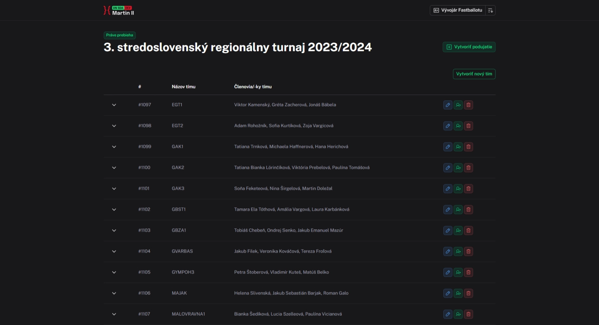

# DN Martin




DN Martin is a web application built with [Nuxt](https://nuxt.com) designed to setup and manage tournaments for [FastBallot](https://fastballot.sk). It streamlines the process of tournament organization and integrates directly with FastBallot services.

---

## Features

- **Tournament Management**: Create and configure debate tournaments.
- **FastBallot Integration**: Directly connects with FastBallot.sk.
- **Modern UI**: Built with Nuxt UI for a cleaner and responsive interface.
- **Authentication**: Secure access using Nuxt Auth Utils.
- **Data Management**: Import/Export capabilities with XLSX support.

## Tech Stack

- **Framework**: [Nuxt 4](https://nuxt.com)
- **UI Library**: [Nuxt UI](https://ui.nuxt.com)
- **Package Manager**: [pnpm](https://pnpm.io)
- **Database**: MySQL (via `mysql2`)
- **Authentication**: `nuxt-auth-utils`
- **Validation**: `zod`

## Setup & Development

Make sure you have `pnpm` installed.

1. **Clone the repository:**
   ```bash
   git clone <repository-url>
   cd dn-martin
   ```

2. **Install dependencies:**
   ```bash
   pnpm install
   ```

3. **Start the development server:**
   ```bash
   pnpm dev
   ```

## CI & Testing

The project includes Continuous Integration (CI) workflows using GitHub Actions tests to ensure code quality.

- **Linting**: `pnpm lint`
- **Type Checking**: `pnpm typecheck`

## Deployment

This project is configured for **Auto-deploy to Vercel**. Pushes to the main branch are automatically built and deployed.

## License

This project is licensed under the [MIT License](LICENSE).

